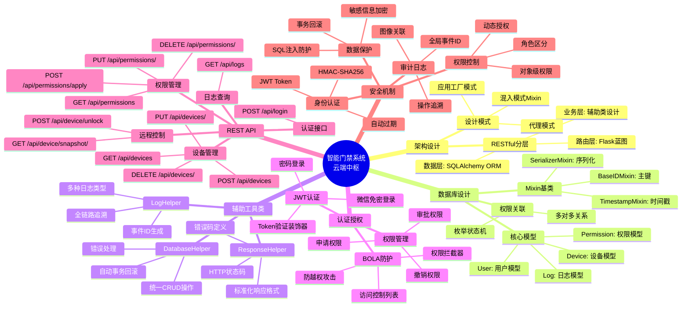
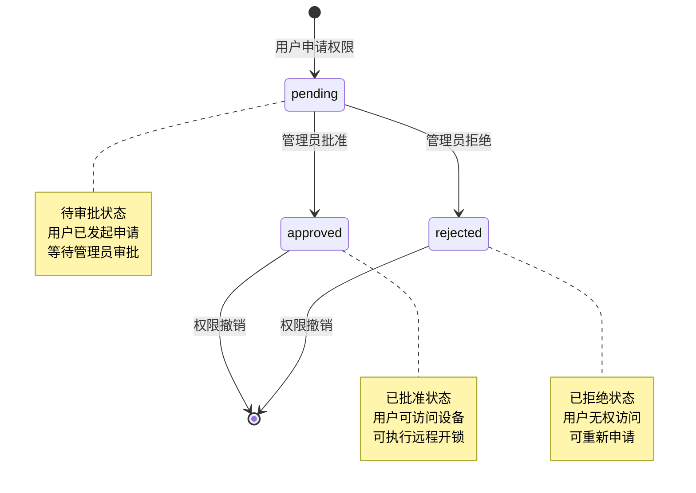
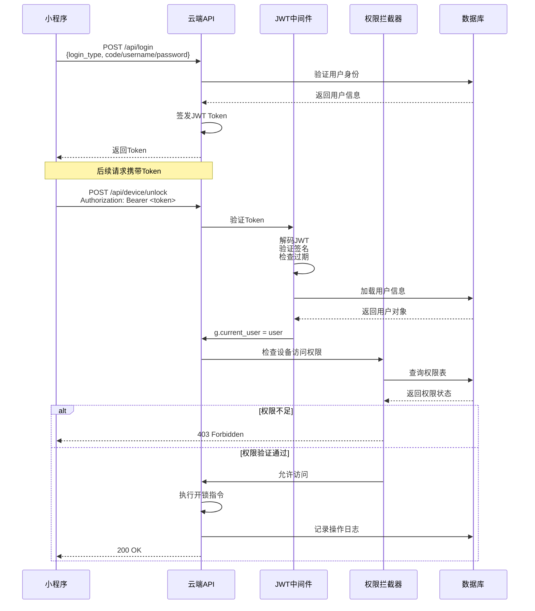
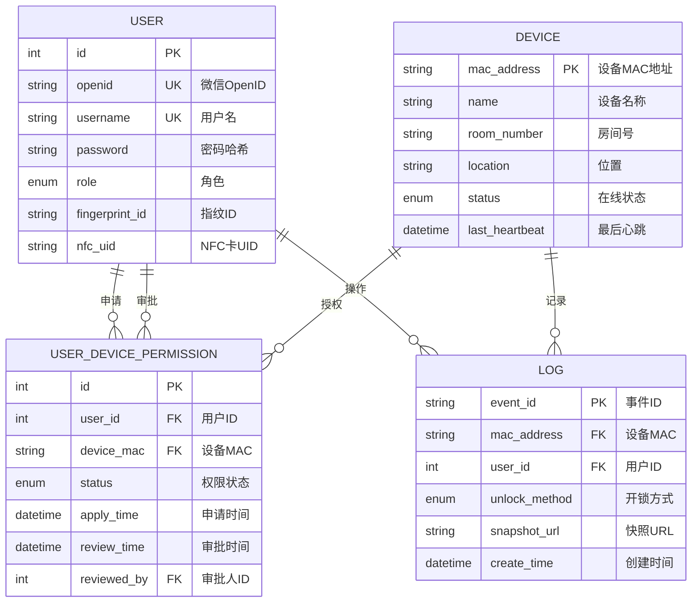
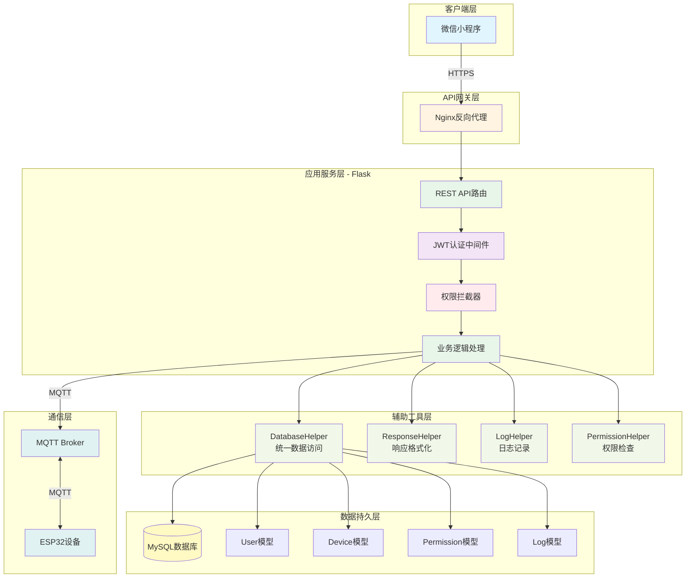
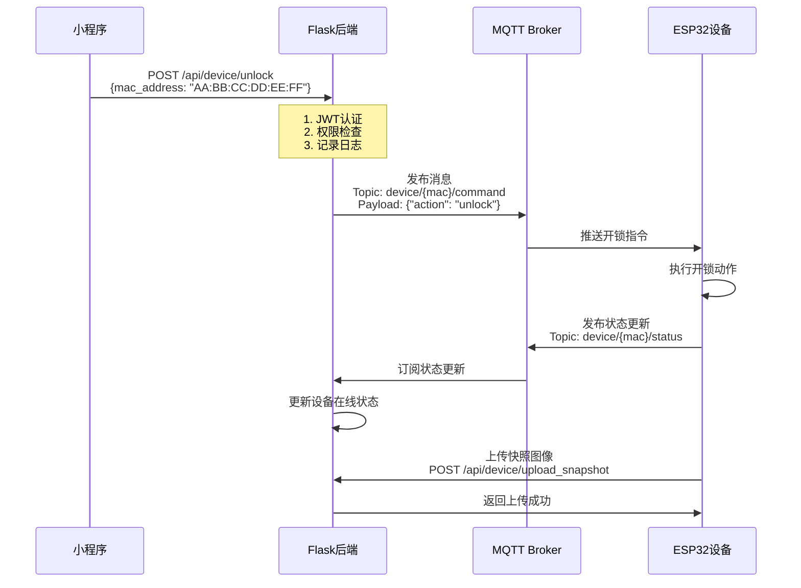
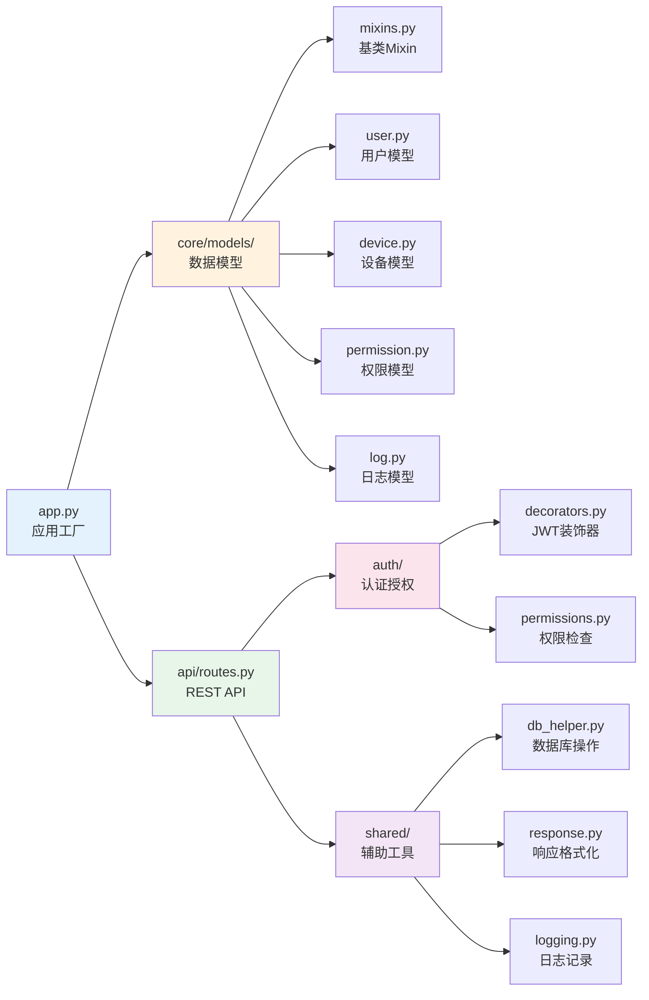
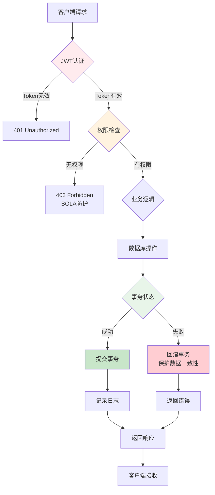
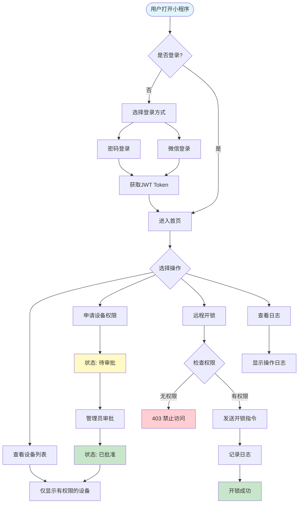

# 智能门禁系统 - 架构思维导图

## 📊 系统架构思维导图

---

## 🔄 权限状态机流转图

---

## 🔐 认证授权流程图

---

## 📊 数据库关系图

---

## 🏗️ 系统架构层次图

---

## 📡 MQTT通信流程图

---

## 🎯 核心代码文件映射

---

## 🔒 安全防护机制图

---

## 📈 使用流程图

---

**文档版本**: 1.0
**创建时间**: 2026-03-06
**作者**: Claude Code Analysis
