# 🏗️ 智慧校园门禁系统 - 完整流程图文档

> **最后更新**: 2026年3月5日  
> **覆盖范围**: 后端启动链路、API 业务流程、小程序端到端、Flask 集成架构、请求处理管道

---

## 📑 目录

1. [后端启动流程](#后端启动流程图)
2. [API 业务流程](#api-业务完整流程)
3. [小程序端到端流程](#小程序端到端流程5个核心场景)
4. [后端 Flask 集成架构](#后端-flask--api-完整集成架构)
5. [请求处理管道](#请求处理完整管道深度剖析)
6. [快速参考](#快速参考api-调用链路)

---

## 后端启动流程图

```mermaid
flowchart TD
    Start([运行 python run.py]) --> ImportApp[导入 create_app]
    ImportApp --> CreateApp[调用 create_app 工厂]
    
    CreateApp --> InitFlask[创建 Flask 实例]
    InitFlask --> SetupDirs[配置 templates/static 目录]
    SetupDirs --> ProxyFix[挂载 ProxyFix 中间件]
    
    ProxyFix --> LoadConfig[加载配置]
    LoadConfig --> ConfigSources{配置来源}
    ConfigSources -->|环境变量| EnvConfig[从 os.environ 读取]
    ConfigSources -->|默认值| DefaultConfig[使用 default 值]
    EnvConfig --> MergeConfig[合并配置]
    DefaultConfig --> MergeConfig
    
    MergeConfig --> InitDB[db.init_app]
    InitDB --> CreateTables[db.create_all 创建表]
    CreateTables --> MigrateSchema[_ensure_device_columns<br/>补齐历史字段]
    
    MigrateSchema --> SeedAdmin{默认 Admin 存在?}
    SeedAdmin -->|否| CreateAdmin[创建 admin/admin123]
    SeedAdmin -->|是| SkipAdmin[跳过]
    CreateAdmin --> RegisterBP
    SkipAdmin --> RegisterBP
    
    RegisterBP[注册蓝图] --> RegAPI[注册 API 蓝图<br/>/api/*]
    RegAPI --> RegWeb[注册 Web 蓝图<br/>/admin/*]
    
    RegWeb --> CheckMQTT{ENABLE_MQTT?}
    CheckMQTT -->|True| InitMQTT[init_mqtt 连接 Broker]
    CheckMQTT -->|False| SkipMQTT[跳过 MQTT]
    
    InitMQTT --> Subscribe[订阅主题<br/>device/+/heartbeat<br/>device/+/pass]
    Subscribe --> AsyncWait[后台线程等待连接<br/>timeout 10s]
    AsyncWait --> Connected{连接成功?}
    Connected -->|是| LogSuccess[记录连接成功]
    Connected -->|否| LogWarn[记录警告<br/>继续启动]
    
    SkipMQTT --> Ready
    LogSuccess --> Ready
    LogWarn --> Ready
    
    Ready[Flask App Ready] --> Listen[app.run 监听<br/>0.0.0.0:5000]
    Listen --> End([后端启动完成])
    
    style Start fill:#e1f5e1
    style End fill:#e1f5e1
    style CheckMQTT fill:#fff3cd
    style SeedAdmin fill:#fff3cd
    style CreateAdmin fill:#f8d7da
    style InitMQTT fill:#d1ecf1
```

---

## API 业务完整流程

```mermaid
flowchart TD
    subgraph 登录认证流程
        L1[POST /api/login] --> L2{login_type?}
        L2 -->|password| L3[校验 username/password]
        L2 -->|wechat| L4[校验 code]
        L2 -->|其他| L5[400 INVALID_LOGIN_TYPE]
        
        L3 --> L6{用户存在?}
        L6 -->|是| L7{密码正确?}
        L6 -->|否| L8[自动创建用户]
        L7 -->|是| L9[签发 JWT]
        L7 -->|否| L10[401 密码错误]
        L8 --> L9
        
        L4 --> L11[_wechat_code_to_openid]
        L11 --> L12{微信 API 成功?}
        L12 -->|否| L13{错误类型}
        L13 -->|WX_ERR_*| L14[401 微信错误]
        L13 -->|其他| L15[500 API 错误]
        
        L12 -->|是| L16{openid 已绑定?}
        L16 -->|是| L9
        L16 -->|否| L17{提供 username+password?}
        L17 -->|是| L18[尝试绑定已有账号]
        L17 -->|否| L19[自动创建微信用户]
        
        L18 --> L20{账号存在且密码正确?}
        L20 -->|是| L21[绑定 openid]
        L20 -->|否| L22[401/404 绑定失败]
        L21 --> L9
        L19 --> L9
        
        L9 --> L23[200 返回 token + user]
    end
    
    subgraph 设备开锁流程
        U1[POST /api/devices/MAC/unlock] --> U2[标准化 MAC]
        U2 --> U3{MAC 格式有效?}
        U3 -->|否| U4[400 格式错误]
        U3 -->|是| U5[permission_helper.check_device_access]
        
        U5 --> U6{权限检查}
        U6 -->|admin| U7[直通]
        U6 -->|非 admin| U8{UserDevicePermission<br/>status=approved?}
        U8 -->|否| U9[403 权限不足]
        U8 -->|是| U7
        
        U7 --> U10[查询设备]
        U10 --> U11{设备存在?}
        U11 -->|否| U12[404 设备不存在]
        U11 -->|是| U13[publish_command MQTT]
        
        U13 --> U14{MQTT 下发成功?}
        U14 -->|否| U15[500 MQTT_ERROR]
        U14 -->|是| U16[log_helper.create_remote_unlock_log]
        
        U16 --> U17{日志写入成功?}
        U17 -->|否| U18[记录错误但不阻断]
        U17 -->|是| U19[200 开锁成功]
        U18 --> U19
    end
    
    subgraph 快照获取流程
        C1[GET /api/device/snapshot/MAC] --> C2[normalize_mac]
        C2 --> C3{权限+设备检查}
        C3 -->|失败| C4[400/403/404]
        C3 -->|成功| C5[优先级1: 云端中继]
        
        C5 --> C6{CLOUD_RELAY_SNAPSHOT_URL<br/>配置?}
        C6 -->|否| C9
        C6 -->|是| C7[requests.get timeout=3]
        C7 --> C8{成功?}
        C8 -->|是| C27[转 Base64 JSON 返回<br/>source: cloud-relay]
        C8 -->|否| C9[优先级2: 内存缓存]
        
        C9 --> C10{device_frames<br/>存在 MAC?}
        C10 -->|否| C13
        C10 -->|是| C11{快照新鲜度<br/><5分钟?}
        C11 -->|是| C12[返回缓存快照<br/>source: cache]
        C11 -->|否| C13[优先级3: 本地 ESP32]
        
        C13 --> C14{设备在线?}
        C14 -->|否| C15[返回 placeholder-offline]
        C14 -->|是| C16[http://device_ip:81/stream]
        
        C16 --> C17{请求成功?}
        C17 -->|是| C18[转 Base64 JSON 返回<br/>source: local-esp32]
        C17 -->|Timeout| C19[返回 placeholder-timeout]
        C17 -->|ConnectionError| C20[返回 placeholder-error]
    end
    
    subgraph 权限申请审批流程
        P1[POST /api/user/apply_device] --> P2[验证 MAC 格式]
        P2 --> P3{设备存在?}
        P3 -->|否| P4[自动创建设备记录]
        P3 -->|是| P5
        P4 --> P5[检查已有权限]
        
        P5 --> P6{UserDevicePermission<br/>存在?}
        P6 -->|是| P7[400 ALREADY_BOUND]
        P6 -->|否| P8{pending 申请存在?}
        P8 -->|是| P9[400 DUPLICATE_APPLICATION]
        P8 -->|否| P10[创建 DeviceApplication<br/>status=pending]
        
        P10 --> P11[200 申请已提交]
        
        P20[PUT /api/admin/applications/ID] --> P21{当前用户为 admin?}
        P21 -->|否| P22[403 Forbidden]
        P21 -->|是| P23{action?}
        
        P23 -->|approve| P24[创建 UserDevicePermission<br/>status=approved]
        P23 -->|reject| P25[仅更新 DeviceApplication<br/>status=rejected]
        P23 -->|其他| P26[400 INVALID_ACTION]
        
        P24 --> P27[更新 DeviceApplication<br/>status=approved]
        P27 --> P28[200 审批成功]
        P25 --> P28
    end
    
    subgraph 日志查询流程
        G1[GET /api/logs] --> G2{当前用户角色}
        G2 -->|admin| G3[查询全量日志]
        G2 -->|非 admin| G4[构建权限过滤]
        
        G4 --> G5[子查询: 用户有权限的设备 MAC]
        G5 --> G6[过滤条件: <br/>user_id=当前用户 OR<br/>mac_address IN 权限列表]
        
        G3 --> G7[Log.query.order_by<br/>create_time.desc]
        G6 --> G7
        
        G7 --> G8[分页查询]
        G8 --> G9[200 返回日志列表]
    end
    
    style L5 fill:#f8d7da
    style L10 fill:#f8d7da
    style L14 fill:#f8d7da
    style L15 fill:#f8d7da
    style L22 fill:#f8d7da
    style U4 fill:#f8d7da
    style U9 fill:#f8d7da
    style U12 fill:#f8d7da
    style U15 fill:#f8d7da
    style C4 fill:#f8d7da
    style P7 fill:#f8d7da
    style P9 fill:#f8d7da
    style P22 fill:#f8d7da
    style P26 fill:#f8d7da
    
    style L23 fill:#d1ecf1
    style U19 fill:#d1ecf1
    style C12 fill:#d1ecf1
    style C27 fill:#d1ecf1
    style C18 fill:#d1ecf1
    style P11 fill:#d1ecf1
    style P28 fill:#d1ecf1
    style G9 fill:#d1ecf1
```

---

## 小程序端到端流程（5个核心场景）

### 场景1️⃣: 微信登录完整流程

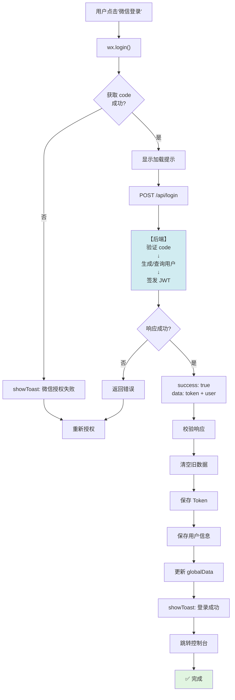

### 场景2️⃣: 设备列表加载

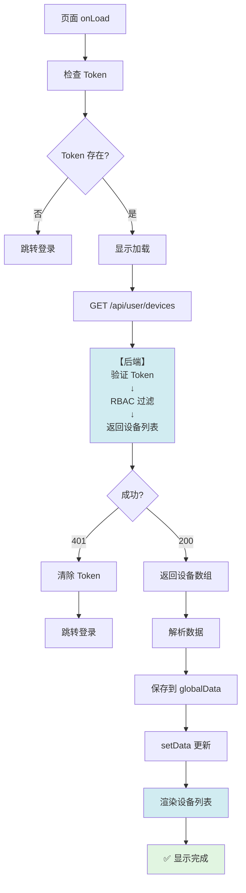

### 场景3️⃣: 快照获取（三层降级）

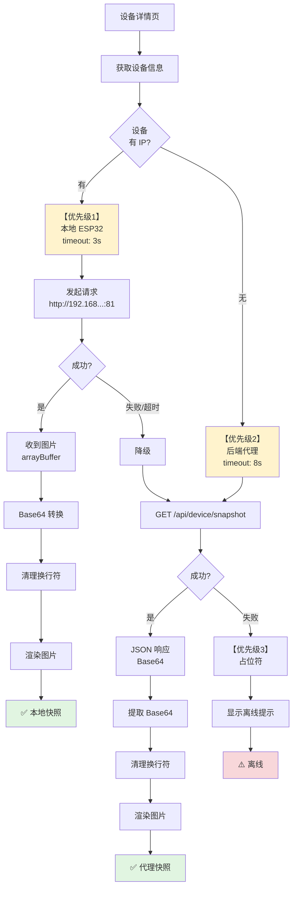

### 场景4️⃣: 设备开锁

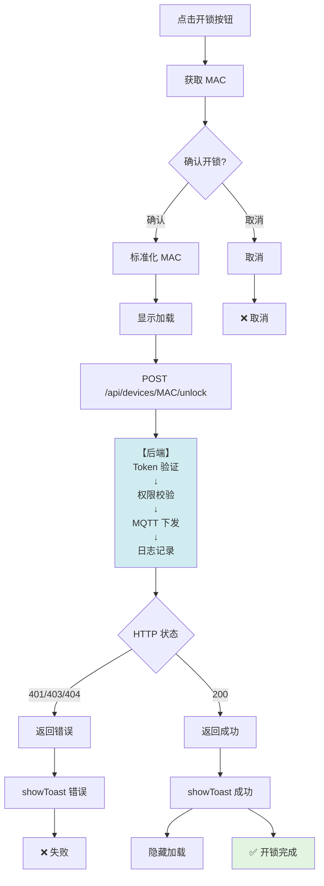

### 场景5️⃣: 日志查询

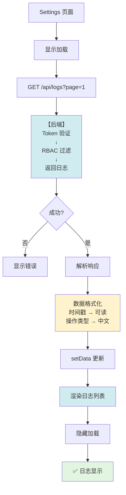

---

## 后端 Flask + API 完整集成架构

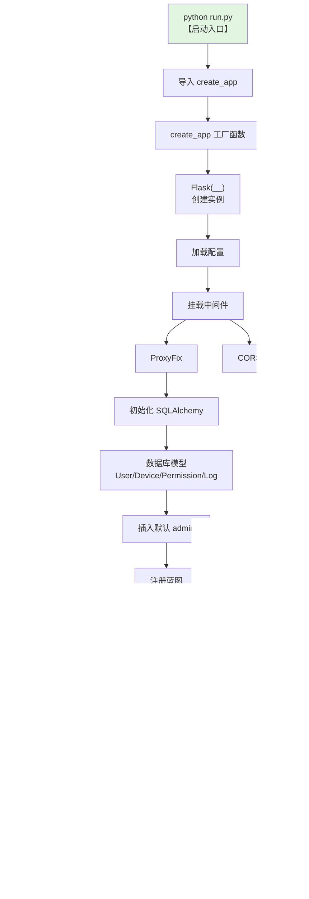

---

## 请求处理完整管道（深度剖析）

```mermaid
flowchart TD
    ClientReq["【小程序】<br/>wx.request()"]
    
    ClientReq --> Network["TCP/SSL 握手"]
    Network --> Flask["Flask WSGI"]
    
    Flask --> ParseReq["解析请求<br/>URL/Method/Headers"]
    
    ParseReq --> RoutingEngine["URL 路由匹配"]
    
    RoutingEngine --> Match{匹配成功?}
    Match -->|否| Match404["404"]
    Match -->|是| Route["找到视图函数"]
    
    Route --> MiddlewareStack["【中间件链】"]
    MiddlewareStack --> MW1["ProxyFix"]
    MW1 --> MW2["CORS"]
    
    MW2 --> DecoratorChain["【装饰器链】<br/>@token_required"]
    
    DecoratorChain --> ExtractToken["提取 JWT"]
    ExtractToken --> ParseJWT["验证签名"]
    ParseJWT --> ValidToken{有效?}
    ValidToken -->|否| Return401["401"]
    ValidToken -->|是| GetUser["获取用户"]
    
    GetUser --> SetContext["设置 g.current_user"]
    
    SetContext --> ViewFunc["【执行业务函数】"]
    ViewFunc --> Normalize["normalize_mac()"]
    Normalize --> Permission["check_device_access()"]
    Permission --> PermCheck{权限?}
    PermCheck -->|否| Return403["403"]
    PermCheck -->|是| QueryDB["db_helper 查询"]
    
    QueryDB --> PublishMQTT["publish_command()"]
    PublishMQTT --> LogEvent["log_helper 记录"]
    LogEvent --> BuildResponse["response_helper"]
    
    BuildResponse --> Serialize["JSON 序列化"]
    Serialize --> RespObj["设置状态 200"]
    RespObj --> SendResponse["返回 HTTP"]
    
    SendResponse -.->|返回| ClientReceive["【小程序】<br/>success 回调"]
    ClientReceive --> ParseResp["JSON.parse()"]
    ParseResp --> ShowUI["showToast()"]
    
    style ViewFunc fill:#d1ecf1
    style SendResponse fill:#d1ecf1
    style ShowUI fill:#e1f5e1
    style Return401 fill:#f8d7da
    style Return403 fill:#f8d7da
```

---

## ESP32 硬件完整流程

### ESP32 启动流程图

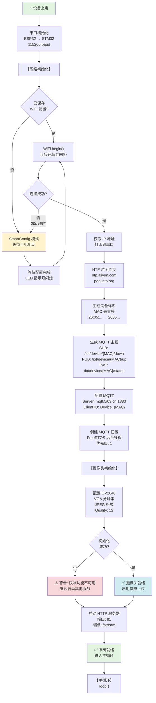

---

### MQTT 订阅与指令处理流程

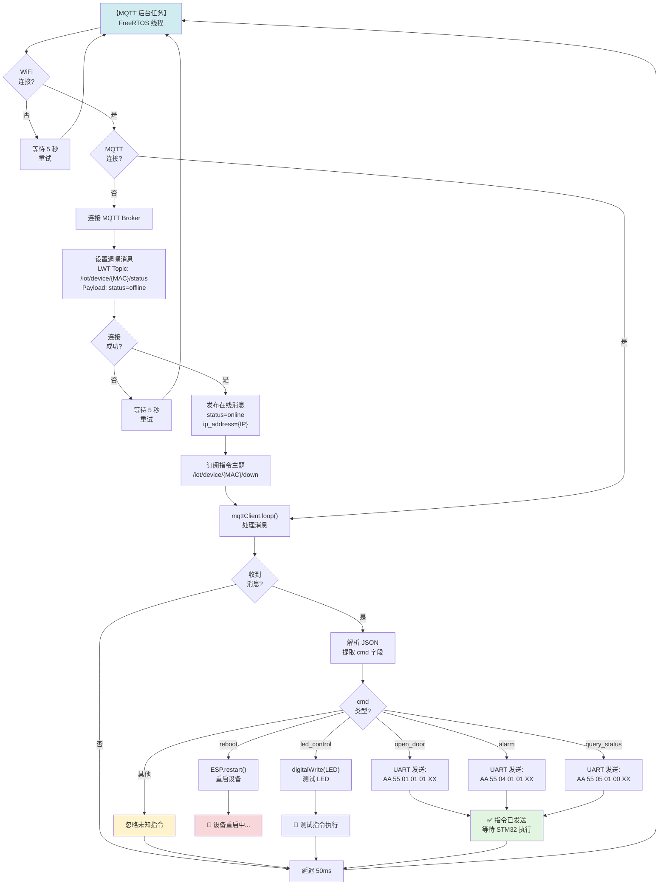

---

### UART 通信双向流程

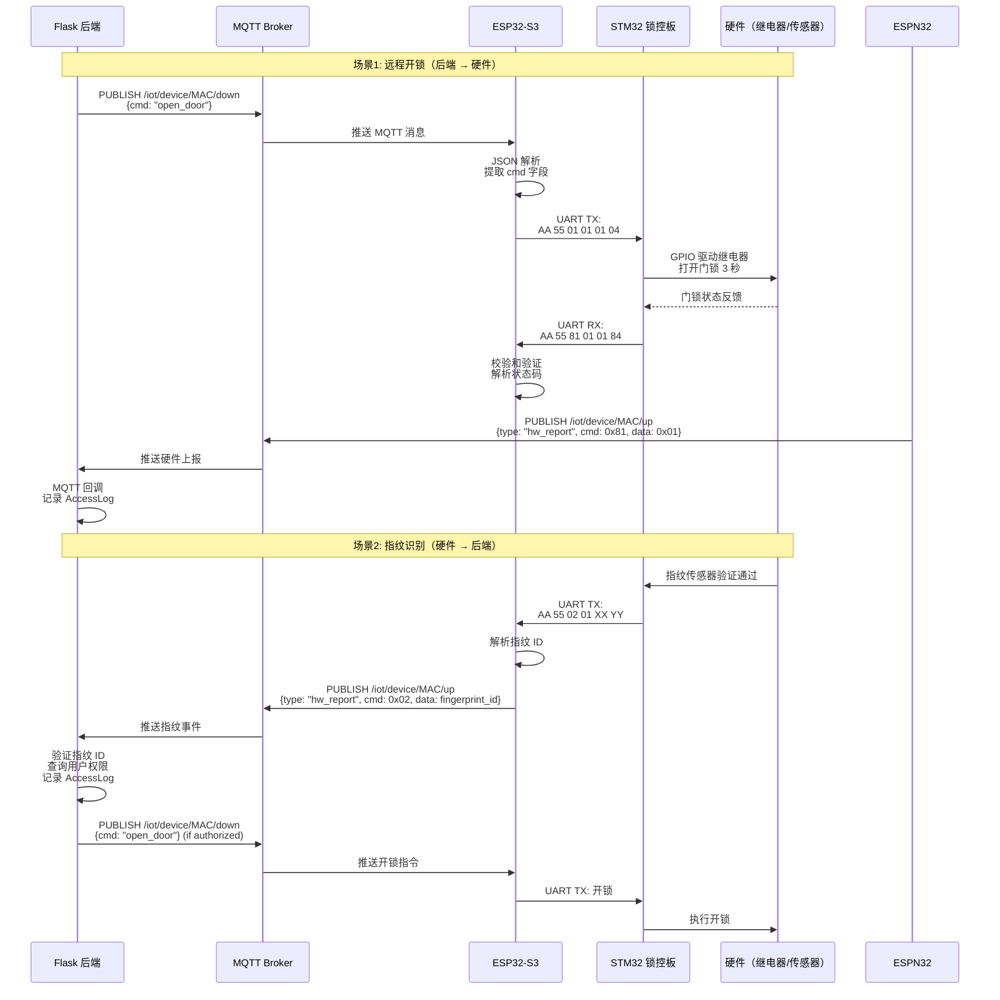

---

### 快照上传机制（HTTP 推送模式）

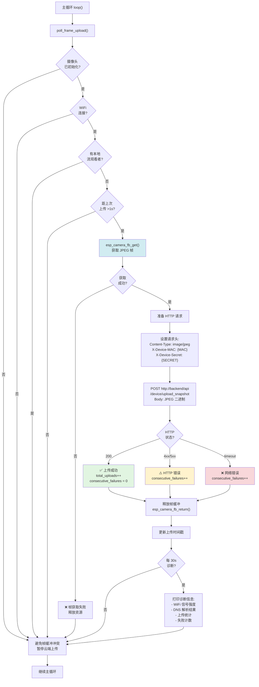

---

### 本地流服务（HTTP Server 端口 81）

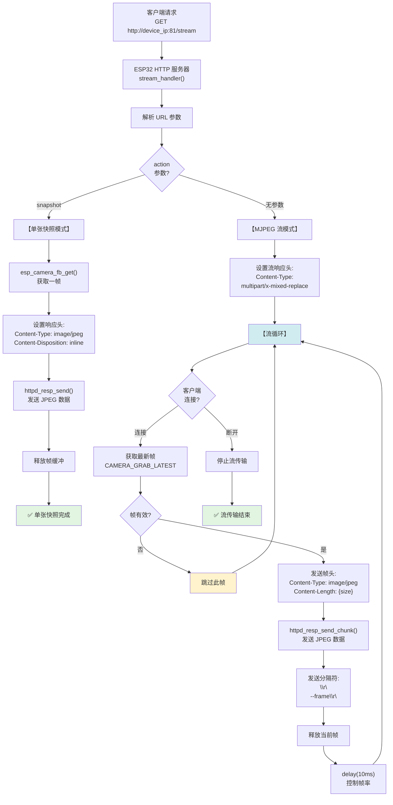

---

### 心跳机制流程

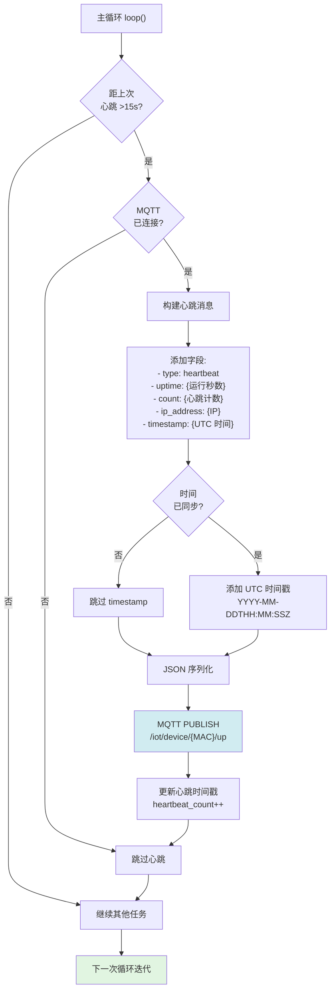

---

### ESP32 完整数据流架构图

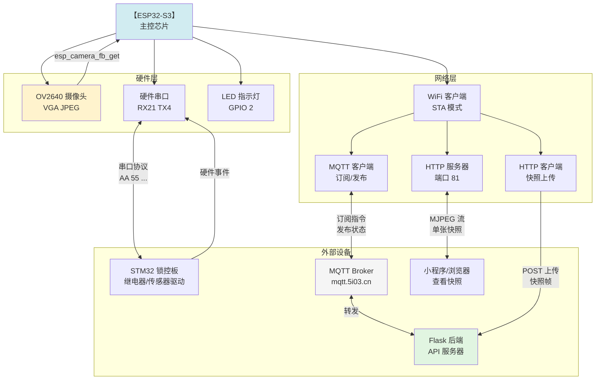

---

## 快速参考：API 调用链路

| 场景 | 路由 | 核心逻辑 | 状态码 |
|------|------|---------|--------|
| **登录** | `POST /api/login` | JWT 签发 | `200` / `401` / `500` |
| **设备列表** | `GET /api/user/devices` | RBAC 过滤 + 分页 | `200` / `401` |
| **快照** | `GET /api/device/snapshot/<mac>` | 三层降级 | `200` / `403` / `404` |
| **开锁** | `POST /api/devices/<mac>/unlock` | MQTT 下发 + 日志 | `200` / `403` / `500` |
| **申请** | `POST /api/user/apply_device` | 创建待审批 | `200` / `400` |
| **审批** | `PUT /api/admin/applications/<id>` | approve/reject | `200` / `403` |
| **日志** | `GET /api/logs` | 权限过滤 | `200` / `401` |

---

## 关键组件映射

| 组件 | 文件 | 职责 |
|------|------|------|
| **启动** | `run.py` | Flask 应用启动入口 |
| **工厂** | `app.py:create_app()` | DB/Config/蓝图初始化 |
| **API** | `api/routes.py` | 所有 REST API 路由 |
| **认证** | `auth/decorators.py` | JWT 验证装饰器 |
| **权限** | `auth/permissions.py` | RBAC 权限检查 |
| **工具** | `shared/` | response/db/log helpers |
| **MQTT** | `mqtt/client.py` | 硬件通信驱动 |
| **模型** | `core/models/` | 数据库 ORM 定义 |

---

> **文档生成**: 2026年3月5日  
> **版本**: 3.0  
> **覆盖**: 后端启动、API、小程序、集成、管道